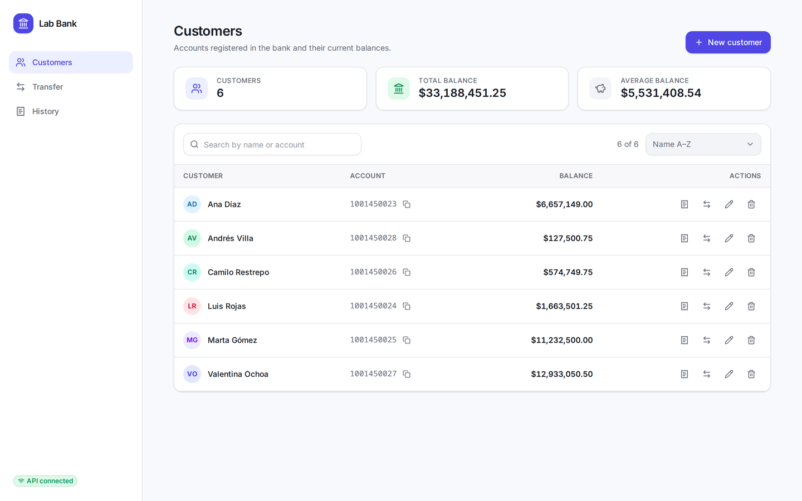
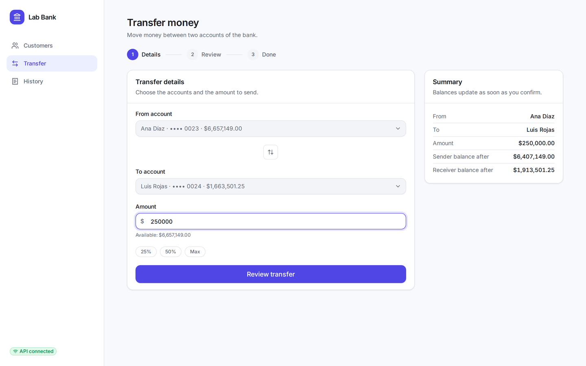
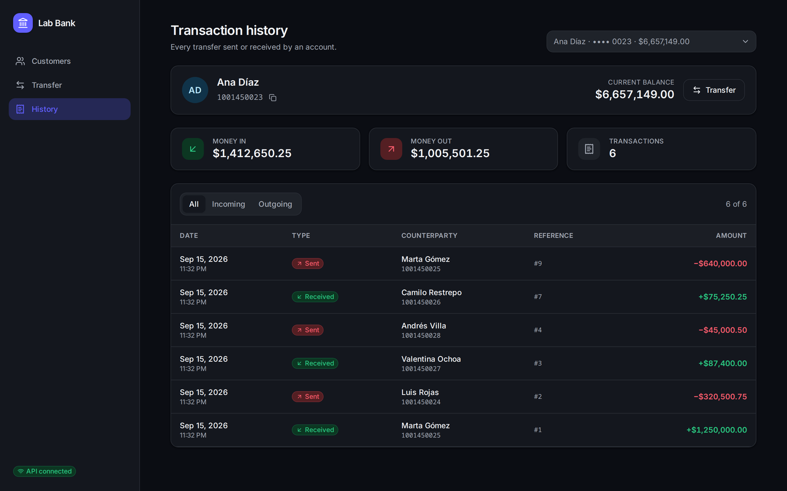
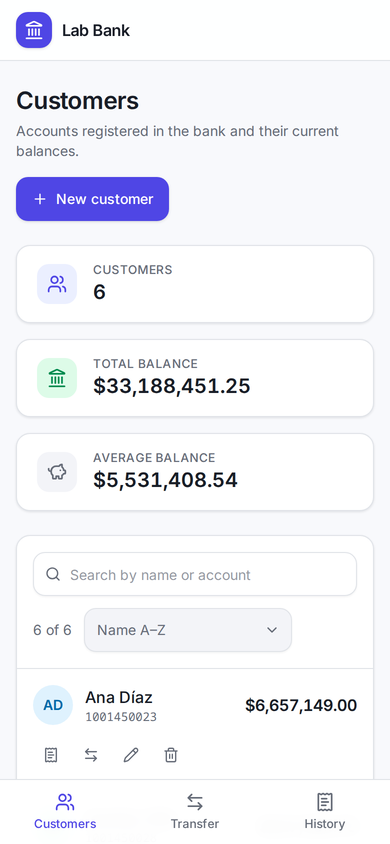
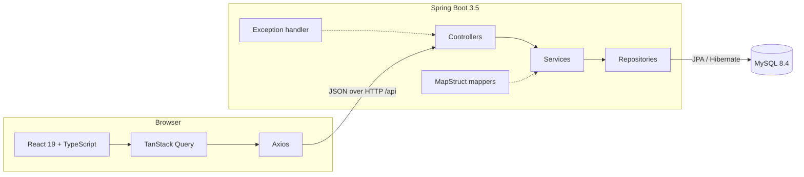

# Lab Bank

A small banking application: a Spring Boot REST API that moves money between accounts, and a React web client to use it. Built for Laboratorio 1 of Arquitectura de Software (Universidad de Antioquia), on top of the course starter repository.



## Quick start

You need **JDK 17+**, **Node 20.19+**, and **Docker or Podman**.

```bash
# 1. Database
podman compose up -d          # or: docker compose up -d

# 2. API → http://localhost:8080
./mvnw spring-boot:run

# 3. Web client → http://localhost:5173
cd frontend && npm install && npm run dev
```

Open <http://localhost:5173>. The sidebar shows **API connected** when the browser can reach the backend; that pill turning red is the fastest way to spot a connection problem.

## What you can do

| View | What it does |
|---|---|
| **Customers** | List, search and sort accounts; create, edit and delete customers |
| **Transfer** | Move money between two accounts with a details → review → receipt flow |
| **History** | Per-customer transaction table with incoming/outgoing filters and totals |

| | |
|---|---|
|  |  |

The interface adapts to phones and follows the operating system's light or dark theme.



## Architecture



| Layer | Responsibility |
|---|---|
| `controller` | HTTP endpoints, request validation, status codes |
| `service` | Business rules and transactions (the transfer runs inside one) |
| `repository` | Spring Data JPA access to MySQL |
| `dto` + `mapper` | Request and response shapes, kept apart from entities |
| `exception` | Domain exceptions translated into RFC 9457 problem details |

The frontend mirrors that separation: each feature (`customers`, `transfers`, `transactions`) owns its `api`, `model`, `components` and `pages`, while `shared/ui` holds the design system. Pages fetch and coordinate; components only render.

## API reference

Base URL: `http://localhost:8080/api`

| Method | Path | Body | Success | Errors |
|---|---|---|---|---|
| GET | `/customers` | – | `200` | – |
| GET | `/customers/{id}` | – | `200` | `404` |
| POST | `/customers` | `{firstName, lastName, accountNumber, balance}` | `201` | `400`, `409` |
| PUT | `/customers/{id}` | `{firstName, lastName}` | `200` | `400`, `404` |
| DELETE | `/customers/{id}` | – | `204` | `404`, `409` |
| POST | `/transactions` | `{senderAccountNumber, receiverAccountNumber, amount}` | `201` | `400`, `404`, `422` |
| GET | `/transactions/{accountNumber}` | – | `200` | `404` |

**Rules:** names are required and at most 50 characters; account numbers are 4 to 20 digits and unique; balances and amounts allow at most 2 decimals; transfer amounts must be positive; sender and receiver must differ; a customer with transactions cannot be deleted. Account numbers and balances are immutable through the customer endpoints — balances only change through transfers.

Errors come back as `application/problem+json`:

```json
{
  "type": "about:blank",
  "title": "Validation failed",
  "status": 400,
  "detail": "One or more fields are invalid.",
  "instance": "/api/customers",
  "errors": { "accountNumber": "Account number must contain 4 to 20 digits" }
}
```

`detail` is always safe to show to the user; `errors` maps a field name to its message.

## Configuration

Both sides read environment variables and fall back to local defaults.

| Variable | Used by | Default |
|---|---|---|
| `DB_URL` | API | `jdbc:mysql://localhost:3306/lab12026p?useSSL=false&allowPublicKeyRetrieval=true&serverTimezone=UTC` |
| `DB_USERNAME` / `DB_PASSWORD` | API | `root` / `root` |
| `SERVER_PORT` | API | `8080` |
| `CORS_ALLOWED_ORIGINS` | API | `http://localhost:5173,http://localhost:4173` |
| `VITE_API_URL` | Web client | `http://localhost:8080` |

Hibernate creates and updates the schema on startup (`ddl-auto=update`), so no migration scripts are needed.

## Project structure

```
.
├── compose.yaml              MySQL service for local development
├── src/main/java/...         Spring Boot API
├── frontend/                 React web client
│   └── src/
│       ├── app/              providers, router, layout
│       ├── features/         customers, transfers, transactions
│       └── shared/           api client, design system, utilities
└── docs/screenshots/         images used in this README
```

## Testing

```bash
./mvnw test                   # API: 30 tests (needs the database running)
cd frontend && npm test       # Web client: 50 tests
cd frontend && npm run lint && npm run typecheck && npm run build
```

Backend tests cover the transfer rules, customer validation and error mapping. Frontend tests mock the API at the network level with MSW and exercise each view the way a user would.

## Development workflow

1. Open an issue describing the change.
2. Branch as `type/description` (`feat/...`, `fix/...`, `docs/...`).
3. Commit with [Conventional Commits](https://www.conventionalcommits.org).
4. Open a pull request that closes the issue; keep every check green.

## Credits

Forked from [diegobotia/lab12026p](https://github.com/diegobotia/lab12026p), the starter project provided with the lab instructions.
