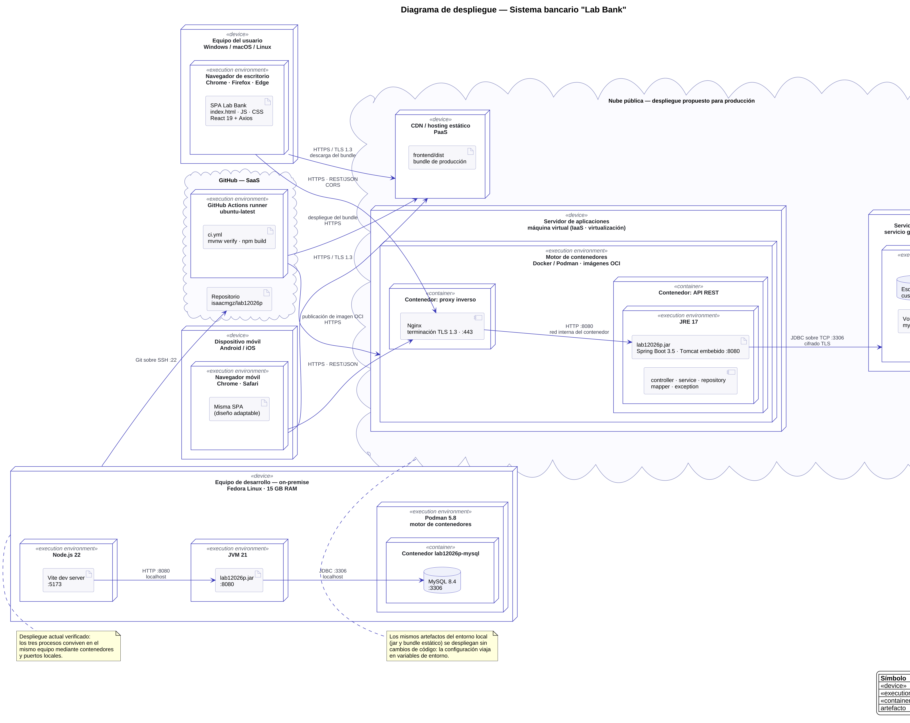
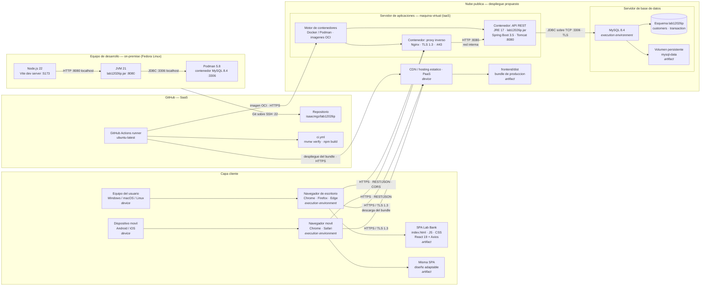

# Diagrama de despliegue — Lab Bank

Este documento contiene el diagrama de despliegue del sistema en dos formatos:

| Archivo | Uso |
|---|---|
| `despliegue.puml` | Fuente en PlantUML, con notación UML de despliegue. Editable en VS Code, IntelliJ o [PlantText](https://www.planttext.com/) |
| `despliegue.svg` | Imagen vectorial, para insertar en documentos sin perder calidad |
| `despliegue.png` | Imagen a 200 ppp, para pegar en presentaciones |
| `despliegue.pdf` | Una página A3 horizontal, lista para imprimir |
| Este archivo | Versión en Mermaid, que GitHub renderiza directamente |



## Versión en Mermaid



## Aspectos de infraestructura representados

| Aspecto | Dónde aparece en el diagrama |
|---|---|
| **On-premise** | Equipo de desarrollo con Fedora Linux, donde hoy conviven los tres procesos |
| **Cloud** | Nube pública con hosting estático (PaaS), servidor de aplicaciones (IaaS) y base de datos gestionada; GitHub como SaaS |
| **Virtualización** | El servidor de aplicaciones es una máquina virtual sobre infraestructura del proveedor |
| **Contenedores** | Imágenes OCI ejecutadas por Docker/Podman: proxy inverso, API y MySQL |
| **Web** | Navegador de escritorio ejecutando la SPA descargada desde el CDN |
| **Mobile** | Navegador móvil consumiendo la misma SPA gracias al diseño adaptable |
| **Protocolos** | HTTPS/TLS 1.3, REST sobre JSON, HTTP interno, JDBC sobre TCP 3306, Git sobre SSH, distribución de imágenes OCI sobre HTTPS |
| **Persistencia** | Volumen persistente `mysql-data`, independiente del ciclo de vida del contenedor |

## Estado actual frente al propuesto

El **entorno de desarrollo** del diagrama es el que está verificado y funcionando: Vite, la API y MySQL en contenedor conviven en el mismo equipo y se comunican por puertos locales.

La **nube pública** corresponde al despliegue propuesto para producción. No requiere cambios en el código: los artefactos son los mismos (`lab12026p.jar` y el bundle estático) y la configuración de base de datos, puerto y orígenes permitidos viaja en variables de entorno, tal como se describe en el README.

## Cómo regenerar las imágenes

```bash
# Requiere plantuml (o el jar oficial) y Java 17+
java -jar plantuml.jar -tpng -Sdpi=200 -o . despliegue.puml
java -jar plantuml.jar -tsvg -o . despliegue.puml
```

El diagrama usa el motor de layout `smetana`, incluido en PlantUML, por lo que no necesita Graphviz instalado.
